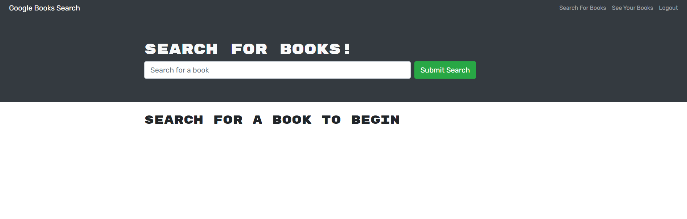
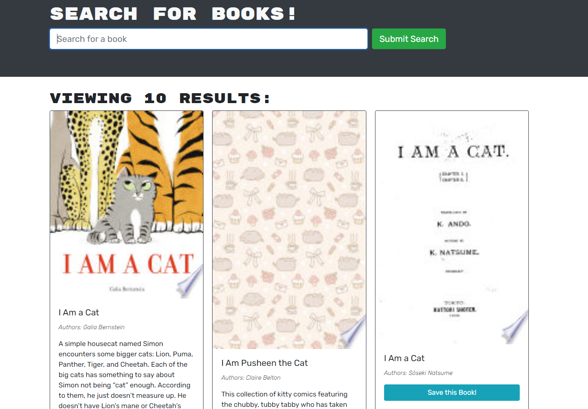

# Book Search Engine

## Description
This application uses the google books API to provide a search engine for books.  Using graphql and mongoose, a user is able to sign in and save their own list of books. Currently a user is able to login, sign up and add books to their favorites.  Viewing books is currently non-functional but will be fixed.

The code was originally written using a RESTful API instead of graphql, but has been refactored to use the latter.

The site will be hosted at https://desolate-escarpment-45756.herokuapp.com/ but has not yet been 

## Table of Contents
 - [Description](#description)
 - [Installation](#installation)
 - [Usage](#usage)
 - [License](#license)
 - [Contributing](#contributing)
 - [Tests](#tests)
 - [Questions](#questions)
 ## Installation

N/A
 
 ## Usage

Please visit the site at: https://desolate-escarpment-45756.herokuapp.com/

It should appear as below

[]

[]

## License
This application is not under any license.

## Contributing
Feel free to submit a pull request.

## Tests
N/A

## Questions
If you have any questions please feel free to reach out to me via email at DPAJBK@gmail.com